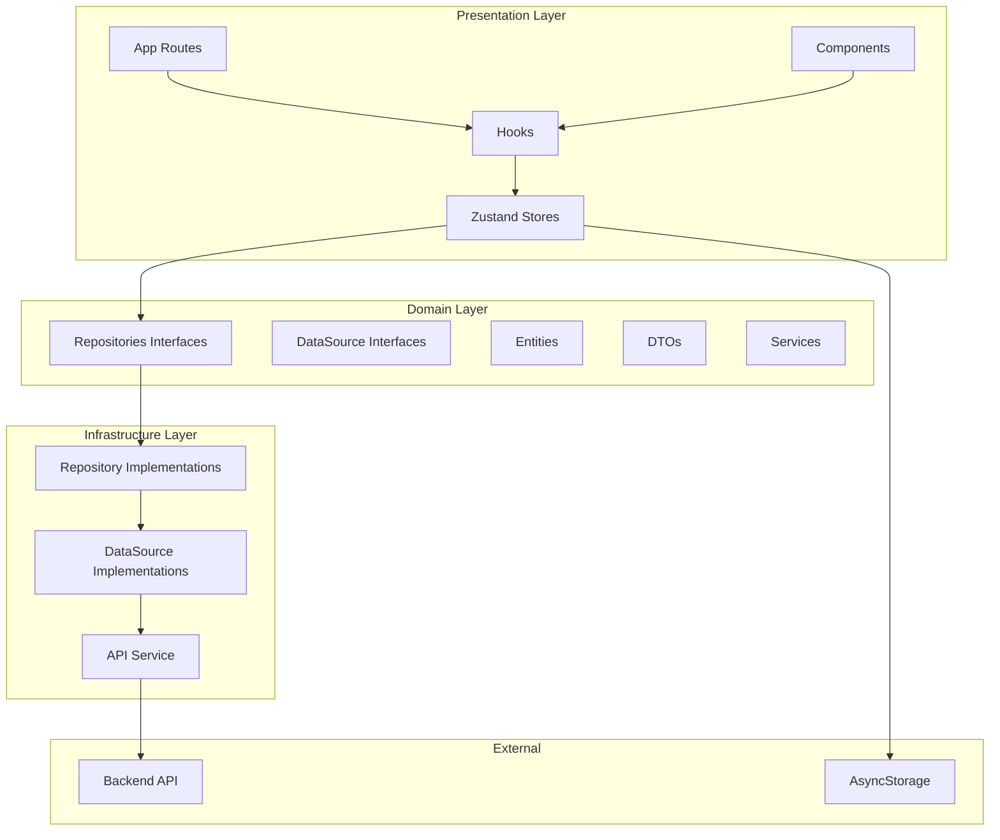
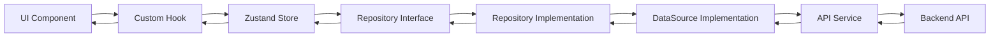
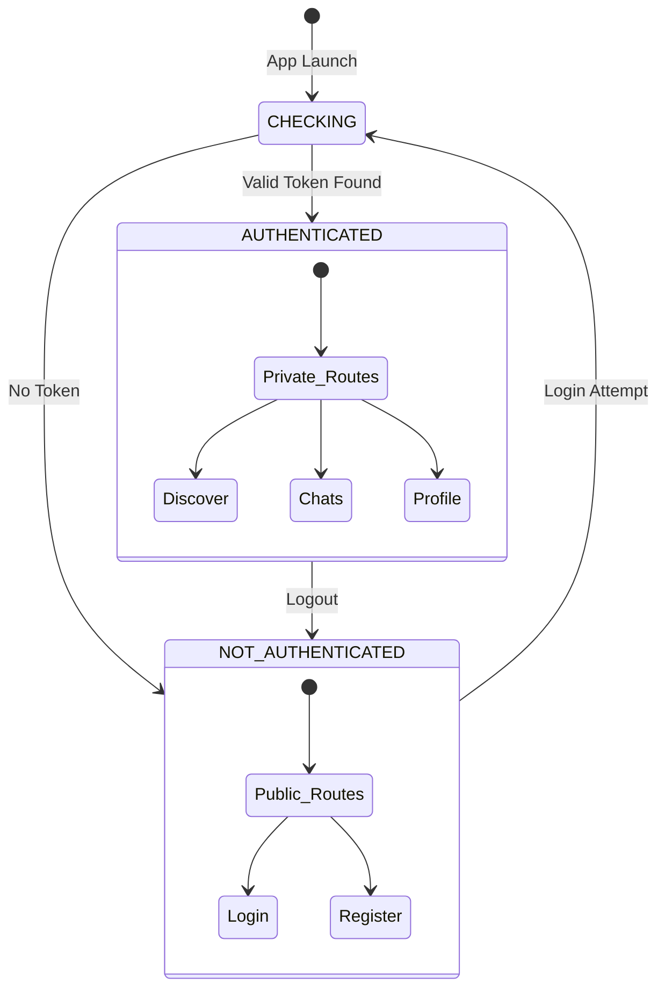
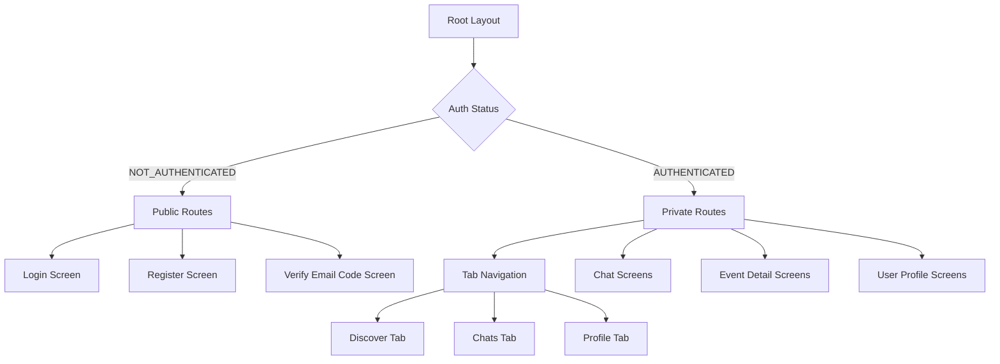

# CampusConnect - Mobile Application

## 📱 Project Overview

**CampusConnect** (formerly Moments) is a mobile application designed for students who want to discover things to do, create events, and meet new people. [1](#0-0) 

The app focuses on bringing students together by making it easy to find activities around the city and connect with others through shared experiences. When a user joins an event, they are automatically added to a group chat with other participants, making it easy to connect, plan, and break the ice before meeting in person. [2](#0-1) 

---

## 🎯 Key Features

- **🔍 Discover Activities & Events** - Browse events and activities happening around the city and campus
- **➕ Create Your Own Events** - Host your own events and invite other students to join
- **🤝 Join Events** - Join events that interest you and meet new people
- **💬 Event-Based Group Chat** - Automatically join a group chat when you join an event and chat with other participants [3](#0-2) 

---

## 🏗️ Architecture Overview

CampusConnect follows **Clean Architecture** principles with a clear separation of concerns across multiple layers:



### Layer Responsibilities

1. **Presentation Layer**: UI components, screens, navigation, and state management
2. **Domain Layer**: Business logic, entities, repository contracts, and use cases
3. **Infrastructure Layer**: Concrete implementations of repositories and data sources
4. **Dependency Injection**: Container for managing dependencies between layers [4](#0-3) 

---

## 🛠️ Tech Stack

### Frontend
- **Framework**: React Native with Expo (~54.0.25)
- **Navigation**: Expo Router (~6.0.15) with typed routes
- **State Management**: Zustand (^5.0.8)
- **UI Components**: Lucide React Native icons
- **Animations**: React Native Reanimated (~4.1.1)
- **HTTP Client**: Axios (^1.13.2)
- **WebSocket**: STOMP.js (^7.2.1) for real-time chat [5](#0-4) 

### Backend
- **API**: Java & Spring Boot
- **Database**: PostgreSQL
- **Authentication**: JWT-based authentication [6](#0-5) 

### Key Libraries
- **Authentication**: Google Sign-In, Expo Auth Session
- **Location**: Expo Location
- **Image Handling**: React Native Image Picker, Expo Image
- **Storage**: AsyncStorage for local data persistence

---

## 📁 Project Structure

```
.
├── app/                        # Expo Router screens
│   ├── (public)/              # Public routes (login, register)
│   ├── (private)/             # Protected routes
│   │   ├── (tabs)/            # Tab navigation (discover, chats, profile)
│   │   ├── chat/              # Chat screens
│   │   ├── event/             # Event detail screens
│   │   └── user/              # User profile screens
│   ├── _layout.tsx            # Root layout with auth check
│   └── index.tsx              # Entry point
├── components/                 # Reusable UI components
│   ├── auth/                  # Authentication components
│   ├── events/                # Event-related components
│   ├── shared/                # Shared components
│   └── user/                  # User-related components
├── domain/                     # Domain layer (Clean Architecture)
│   ├── datasources/           # Data source interfaces
│   ├── infrastructure/         # Concrete implementations
│   │   ├── datasources/       # API datasource implementations
│   │   └── repositories/      # Repository implementations
│   ├── model/                 # Domain models
│   │   ├── dto/               # Data Transfer Objects
│   │   ├── entities/          # Domain entities
│   │   ├── enums/             # Enumerations
│   │   └── shared/            # Shared models
│   ├── repository/            # Repository interfaces
│   ├── services/              # Service interfaces
│   └── services_impl/         # Service implementations
├── store/                      # Zustand state management
│   ├── auth/                  # Authentication store
│   ├── chat/                  # Chat store
│   ├── events/                # Events store
│   └── user/                  # User store
├── hooks/                      # Custom React hooks
│   ├── auth/                  # Auth-related hooks
│   ├── chat/                  # Chat-related hooks
│   ├── events/                # Event-related hooks
│   ├── location/              # Location hooks
│   └── user/                  # User hooks
├── dependency_injection/       # DI container
│   └── container.ts           # Dependency injection setup
├── constants/                  # App constants and theme
├── shared/                     # Shared utilities
└── scripts/                    # Build and utility scripts
```

---

## 🔄 Data Flow Architecture



### Example: Event Repository Pattern

The app uses the Repository Pattern to abstract data access: [7](#0-6) 

The implementation delegates to the DataSource layer: [8](#0-7) 

The DataSource defines the contract for remote API calls: [9](#0-8) 

---

## 🔐 Authentication Flow



The app uses a centralized auth store with Zustand to manage authentication state: [10](#0-9) 

The root layout checks authentication status on app launch and shows appropriate screens: [11](#0-10) 

### Authentication Methods

1. **Email Login with Code Verification**: Request code → Verify code → Authenticated [12](#0-11) 
2. **External Login (Google)**: Google OAuth → Token validation → Authenticated [13](#0-12) 
3. **Session Persistence**: Tokens stored in AsyncStorage for auto-login [14](#0-13) 

---

## 🚀 Navigation Structure



The app uses Expo Router with file-based routing and typed routes: [15](#0-14) 

---

## 💾 State Management

CampusConnect uses **Zustand** for state management, organized by feature domain:

- **Auth Store**: User authentication, login, logout, session management
- **Events Store**: Event discovery, filtering, creation, participation
- **Chat Store**: Real-time messaging, chat rooms, WebSocket connections
- **User Store**: User profiles, preferences, settings

Each store follows a consistent pattern with:
- State properties
- Action methods
- Error handling
- Loading states [16](#0-15) 

---

## 🔌 Dependency Injection

The app uses a simple DI container to manage dependencies between layers: [4](#0-3) 

This ensures:
- **Loose coupling** between layers
- **Testability** through interface abstractions
- **Single source of truth** for service instances
- **Easy configuration** and dependency management

---

## 🌐 API Service Layer

The API service provides a consistent interface for HTTP operations: [17](#0-16) 

All API calls go through this service, which handles:
- Request/response transformation
- Authentication token injection
- Error handling
- Request/response interceptors

---

## 📱 Getting Started

### Prerequisites
- Node.js (v18 or higher)
- npm or yarn
- Expo CLI
- iOS Simulator (Mac) or Android Studio

### Installation

```bash
# Clone the repository
git clone https://github.com/Juangmz7/Moments-mobile.git

# Navigate to project directory
cd Moments-mobile

# Install dependencies
npm install

# Start the development server
npm start
```

### Available Scripts [18](#0-17) 

- `npm start` - Start the Expo development server
- `npm run android` - Run on Android emulator/device
- `npm run ios` - Run on iOS simulator/device
- `npm run web` - Run in web browser
- `npm run lint` - Run ESLint

---

## 🎨 Design Patterns Used

### 1. **Clean Architecture**
- Separation of concerns across layers
- Domain-driven design
- Interface-based abstractions

### 2. **Repository Pattern**
- Abstraction of data access logic
- Interface-based contracts
- Dependency inversion

### 3. **Dependency Injection**
- Constructor injection
- Centralized container
- Loose coupling

### 4. **State Management**
- Centralized stores per domain
- Action-based mutations
- React hooks integration

### 5. **File-based Routing**
- Convention over configuration
- Typed routes with Expo Router
- Layout-based route grouping

---

## 🔑 Key Concepts

### Protected Routes
The app uses route groups to separate public and private screens: [19](#0-18) 

### Real-time Communication
WebSocket integration using STOMP.js for event-based group chats: [20](#0-19) 

### Location Services
Expo Location for discovering nearby events and location-based filtering: [21](#0-20) 

---

## 📄 Configuration

### App Configuration [22](#0-21) 

### Platform-specific Settings
- **iOS**: Bundle identifier, tablet support
- **Android**: Package name, adaptive icons, edge-to-edge enabled
- **Web**: Static output, favicon [23](#0-22) 

---

## 🎓 Target Audience

- University and college students
- Exchange and international students
- Anyone looking to be more social during their studies [24](#0-23) 

---

## 📈 Project Status

CampusConnect is a school project currently under development. [25](#0-24) 

---

## 🎯 Vision

The goal is to make student life more social, inclusive, and connected by lowering the barrier to meeting new people and discovering new experiences. [26](#0-25) 

---

## 📚 Additional Resources

### Documentation
- [Expo Documentation](https://docs.expo.dev/)
- [React Native Documentation](https://reactnative.dev/)
- [Zustand Documentation](https://zustand-demo.pmnd.rs/)

### Backend Integration
This mobile app integrates with a Java Spring Boot backend API for:
- User authentication and authorization
- Event management (CRUD operations)
- Real-time chat functionality
- User profile management

---

## 🤝 Contributing

This is a school project. Contributions, issues, and feature requests are welcome for educational purposes.

---

## 📄 License

This project was created as part of a school project. Licensing details may be updated in the future. [27](#0-26) 

---

## Notes

This README provides a comprehensive architectural overview of the CampusConnect mobile application. The project demonstrates professional software engineering practices including:

- **Clean Architecture** with clear separation between domain, infrastructure, and presentation layers
- **Repository Pattern** for data access abstraction
- **Dependency Injection** for loose coupling and testability
- **Type Safety** with TypeScript throughout
- **Modern React Patterns** with hooks and functional components
- **State Management** using Zustand for predictable state updates
- **File-based Routing** with Expo Router for scalable navigation

The architecture is designed to be maintainable, testable, and scalable as the project grows.

### Citations

**File:** README.md (L1-5)
```markdown
# CampusConnect 🎓

Moments is a mobile application designed for students who want to discover things to do, create events, and meet new people.

The app focuses on bringing students together by making it easy to find activities around the city and connect with others through shared experiences.
```

**File:** README.md (L13-13)
```markdown
Users can explore activities happening nearby, host their own events, and join others with just a tap. When a user joins an event, they are automatically added to a group chat with other participants, making it easy to connect, plan, and break the ice before meeting in person.
```

**File:** README.md (L17-30)
```markdown
## ✨ Key Features

- 🔍 **Discover Activities & Events**  
  Browse events and activities happening around the city and campus.

- ➕ **Create Your Own Events**  
  Host your own events and invite other students to join.

- 🤝 **Join Events**  
  Join events that interest you and meet new people.

- 💬 **Event-Based Group Chat**  
  Automatically join a group chat when you join an event and chat with other participants.

```

**File:** README.md (L33-38)
```markdown
## 🛠️ Tech Stack

- **Mobile App:** Expo & React Native  
- **Backend API:** Java & Spring Boot  
- **Database:** PostgreSQL  
- **Authentication:** Java-based authentication (e.g. Spring Security / JWT)
```

**File:** README.md (L42-46)
```markdown
## 🎓 Who Is It For?

- University and college students  
- Exchange and international students  
- Anyone looking to be more social during their studies  
```

**File:** README.md (L50-52)
```markdown
## 📚 Project Status

Moments is a school project currently under development.
```

**File:** README.md (L56-58)
```markdown
## 🙌 Vision

Our goal is to make student life more social, inclusive, and connected by lowering the barrier to meeting new people and discovering new experiences.
```

**File:** README.md (L62-66)
```markdown
## 📄 License

This project was created as part of a school project.

Licensing details may be updated in the future.
```

**File:** dependency_injection/container.ts (L11-32)
```typescript
// Container for dependency injection
const apiService = new ApiServiceImpl();
const eventDataSource = new EventDataSourceImpl(apiService);
const chatDataSource = new ChatDatasourceImpl(apiService);
const userProfileDataSource = new UserProfileDataSourceImpl(apiService);

const eventRepository = new EventRepositoryImpl(eventDataSource);
const chatRepository = new ChatRepositoryImpl(chatDataSource);
const userProfileRepository = new UserProfileRepositoryImpl(userProfileDataSource);

// Auth
const authDataSource = new AuthDataSourceImpl(apiService);
const authRepository = new AuthRepositoryImpl(authDataSource);

export const container = {
  apiService,
  eventDataSource,
  eventRepository,
  authRepository,
  chatRepository,
  userProfileRepository,
};
```

**File:** package.json (L6-12)
```json
    "start": "expo start",
    "reset-project": "node ./scripts/reset-project.js",
    "android": "expo run:android",
    "ios": "expo run:ios",
    "web": "expo start --web",
    "lint": "expo lint"
  },
```

**File:** package.json (L13-59)
```json
  "dependencies": {
    "@expo/vector-icons": "^15.0.2",
    "@react-native-async-storage/async-storage": "^2.2.0",
    "@react-native-community/datetimepicker": "^8.5.1",
    "@react-native-google-signin/google-signin": "^16.0.0",
    "@react-navigation/bottom-tabs": "^7.4.0",
    "@react-navigation/elements": "^2.6.3",
    "@react-navigation/native": "^7.1.8",
    "@stomp/stompjs": "^7.2.1",
    "async-storage": "^0.1.0",
    "axios": "^1.13.2",
    "countries-list": "^3.2.2",
    "date-fns": "^4.1.0",
    "expo": "~54.0.25",
    "expo-auth-session": "~7.0.9",
    "expo-constants": "~18.0.9",
    "expo-crypto": "~15.0.7",
    "expo-font": "~14.0.9",
    "expo-haptics": "~15.0.7",
    "expo-image": "~3.0.10",
    "expo-linking": "~8.0.9",
    "expo-location": "~19.0.8",
    "expo-router": "~6.0.15",
    "expo-splash-screen": "~31.0.11",
    "expo-status-bar": "~3.0.8",
    "expo-symbols": "~1.0.7",
    "expo-system-ui": "~6.0.8",
    "expo-web-browser": "~15.0.9",
    "iso-639-1": "^3.1.5",
    "lucide-react-native": "^0.555.0",
    "qs": "^6.14.0",
    "react": "19.1.0",
    "react-dom": "19.1.0",
    "react-native": "0.81.5",
    "react-native-gesture-handler": "~2.28.0",
    "react-native-image-picker": "^8.2.1",
    "react-native-reanimated": "~4.1.1",
    "react-native-root-siblings": "^5.0.1",
    "react-native-root-toast": "^4.0.1",
    "react-native-safe-area-context": "~5.6.0",
    "react-native-screens": "~4.16.0",
    "react-native-svg": "^15.15.1",
    "react-native-web": "~0.21.0",
    "react-native-worklets": "0.5.1",
    "text-encoding": "^0.7.0",
    "text-encoding-polyfill": "^0.6.7",
    "zustand": "^5.0.8"
```

**File:** domain/repository/events/event_repository.ts (L8-11)
```typescript
/**
 * Domain repository contract for Events
 */
export interface EventRepository {
```

**File:** domain/infrastructure/repositories/events/event_repository_impl.ts (L10-18)
```typescript
/**
 * Repository implementation that delegates all data fetching and persistence
 * logic to the EventDataSource layer.
 * * Acts as a boundary between the domain (business logic)
 * and the data layer (API, database, etc.).
 */
export class EventRepositoryImpl implements EventRepository {

  constructor(private readonly dataSource: EventDataSource) {}
```

**File:** domain/datasources/events/event_datasource.ts (L8-11)
```typescript
/**
 * Remote DataSource contract for Events 
 */
export interface EventDataSource {
```

**File:** store/auth/use_auth_store.ts (L14-45)
```typescript
interface UserAuthStore {
  user: User | null;
  authStatus: AuthStatus;
  accessToken: string | null;

  errorLogin: string | null;
  isLoginLoading: boolean;

  errorExternalLogin: string | null;
  isExternalLoginLoading: boolean;

  errorRegister: string | null;
  isRegisterLoading: boolean;

  errorCode: string | null
  isLoadingCode: boolean

  setUser: (user: User) => void;
  setAuthStatus: (status: AuthStatus) => void;
  setLoginError: (message: string | null) => void;
  setCodeError: (message: string | null) => void;
  setAccessToken: (token: string | null) => void
  clearUser: () => Promise<void>;

  initializeSession: () => void;
  requestExternalLogin: (idToken: string) => Promise<boolean>;
  requestLoginEmail: (email: string) => Promise<boolean>;
  verifyEmailCode: (code: string) => Promise<boolean>;
  register: (email: string) => Promise<boolean>;
  logout: () => Promise<void>;
  setUserAuthenticated: (resp: UserAuthResponse) => Promise<void>;
}
```

**File:** store/auth/use_auth_store.ts (L47-62)
```typescript
export const useUserAuthStore = create<UserAuthStore>((set, get) => ({
  user: null,
  authStatus: AuthStatus.CHECKING,
  accessToken: null,
  
  errorLogin: null,
  isLoginLoading: false,

  errorExternalLogin: null,
  isExternalLoginLoading: false,

  errorCode: null,
  isLoadingCode: false,

  errorRegister: null,
  isRegisterLoading: false,
```

**File:** store/auth/use_auth_store.ts (L89-127)
```typescript
  initializeSession: async () => {
    const state = get()

    try {
      // Assure the status is checking
      set({ authStatus: AuthStatus.CHECKING });

      // TODO: Cache the user profile (save it when filling it)
      const token = await AsyncStorage.getItem(StorageType.ACCESS_TOKEN);
      const json = await AsyncStorage.getItem(StorageType.USER_CREDENTIALS);
      
      if (token && json) {
        
        const credentials: UserSessionCredentials = JSON.parse(json)
        state.setAccessToken(token)

        // Restore the session
        // TODO: Fetch user & profile data from backend
        set({ 
            authStatus: AuthStatus.AUTHENTICATED,
            user: new User(
              credentials.email,
              credentials.username
            ) 
        });

      } else {

        set({ authStatus: AuthStatus.NOT_AUTHENTICATED });
        state.clearUser()
        
      }
    } catch (error) {

      set({ authStatus: AuthStatus.NOT_AUTHENTICATED });

      state.clearUser()
    }
  },
```

**File:** store/auth/use_auth_store.ts (L130-164)
```typescript
  requestExternalLogin: async (idToken: string) => {

    if (idToken.trim().length === 0) return false

    const state = get()
    
    if (state.isExternalLoginLoading) {
      set({ errorExternalLogin: "Request already in process" })
      return false
    }

    set({ isExternalLoginLoading: true, errorExternalLogin: null })

    // Validate the token with the backend
    try {

      // repo request
      const response = await container.authRepository.externalLogin({ token: idToken })
      state.setUserAuthenticated(response)

      set({ isExternalLoginLoading: false })
      return true

    } catch (error: unknown){

      set({
        errorExternalLogin: getErrorMessage(error),
        isExternalLoginLoading: false,
        authStatus: AuthStatus.NOT_AUTHENTICATED
      })

      return false
    }

  },
```

**File:** store/auth/use_auth_store.ts (L166-193)
```typescript
  /**
   * Starts email login by requesting a verification code.
   * Stores a temporary user with the email.
   */
  requestLoginEmail: async (email: string) => {
    const state = get();

    if (state.isLoginLoading) {
      state.setLoginError("Request already in process")
      return false
    }

    try {
      set({ isLoginLoading: true, errorLogin: null });

      const request: UserAuthRequest = { email };
      await container.authRepository.requestLoginEmail(request);

      state.setUser(new User(email, ""))
      set({ isLoginLoading: false })

      return true

    } catch (e: unknown) {
      set({ errorLogin: getErrorMessage(e), isLoginLoading: false });
      return false
    }
  },
```

**File:** app/_layout.tsx (L24-34)
```typescript
  // 1. Check session once on app launch
  useEffect(() => {
    initializeSession();
  }, []);

  // 2. Show spinner while checking auth to prevent premature navigation
  if (authStatus === AuthStatus.CHECKING) {
    return (
      <FullscreenLoader/>
    );
  }
```

**File:** app/_layout.tsx (L40-44)
```typescript
        <Stack screenOptions={{ headerShown: false }}>
          <Stack.Screen name="(public)" options={{ headerShown: false }} />
          <Stack.Screen name="(private)" options={{ headerShown: false }} />
          <Stack.Screen name="modal" options={{ presentation: 'modal', title: 'Modal' }} />
        </Stack>
```

**File:** app.json (L2-29)
```json
  "expo": {
    "name": "campusconnect",
    "slug": "campusconnect",
    "version": "1.0.0",
    "orientation": "portrait",
    "icon": "./assets/images/icon.png",
    "scheme": "campusconnect",
    "userInterfaceStyle": "automatic",
    "newArchEnabled": true,
    "ios": {
      "bundleIdentifier": "com.mbproyect.campusconnect",
      "supportsTablet": true
    },
    "android": {
      "package": "com.mbproyect.campusconnect",
      "adaptiveIcon": {
        "backgroundColor": "#E6F4FE",
        "foregroundImage": "./assets/images/android-icon-foreground.png",
        "backgroundImage": "./assets/images/android-icon-background.png",
        "monochromeImage": "./assets/images/android-icon-monochrome.png"
      },
      "edgeToEdgeEnabled": true,
      "predictiveBackGestureEnabled": false
    },
    "web": {
      "output": "static",
      "favicon": "./assets/images/favicon.png"
    },
```

**File:** app.json (L53-55)
```json
    "experiments": {
      "typedRoutes": true,
      "reactCompiler": true
```

**File:** domain/services/api_service.ts (L1-6)
```typescript
export interface ApiService {
  get: <T>(endpoint: string, params?: Record<string, any>, auth?: boolean) => Promise<T>;
  post: <T>(endpoint: string, body?: unknown, auth?: boolean) => Promise<T>;
  put: <T>(endpoint: string, body?: unknown, auth?: boolean) => Promise<T>;
  delete: <T>(endpoint: string, auth?: boolean) => Promise<T>;
}
```
